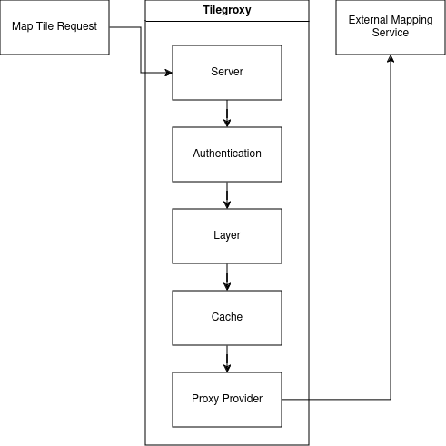
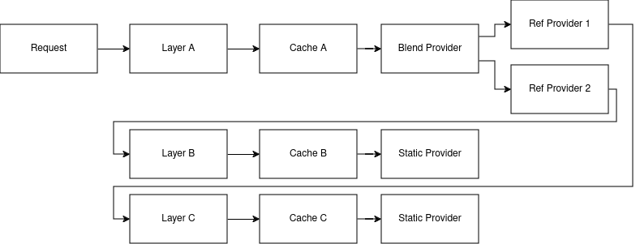

# Configuration

Tilegroxy is heavily configuration driven. This document describes the various configuration options available. [Complete examples are available here.](../examples/configurations/)

Some configuration sections ([authentication](#authentication), [provider](#provider), [cache](#cache), and [secret](#secret)) support selecting different methods of operation that change the full list of parameters available. For example,  a "proxy" provider requires a `url` parameter to get a map tile from another server while a "static" provider takes in a `image` to return for every request. You select these operating modes using a parameter called `name`. Since these entities are too dynamic to have fixed environment variables and frequently may require a secret to operate, any string parameters can be made to use an environment variable by specifying a value in the format of `env.ENV_VAR_NAME`.  You can also use an external secret store [if configured](#secret) by specifying a value in the format `secret.SECRET_NAME`

Configuration key names are case-insensitive unless indicated otherwise. Names are always lower case. 

Some parameters can be specified by environment variables which must be upper case. Environment variables override config parameters which override default values. 

The following is the top-level configuration structure. All top-level keys are optional besides layers:


> [server](#server):  ...  
> [client](#client):  ...  
> [logging](#log):  ...  
> [telemetry](#telemetry): ...  
> [error](#error):  ...  
> [secret](#secret): ...  
> [authentication](#authentication):  ...  
> [cache](#cache):  ...  
> [layers](#layer):    
>    \- ...  


## Layer

A layer represents a distinct mapping layer as would be displayed in a typical web map application.  Each layer can be accessed independently from other map layers. The main thing that needs to be configured for a layer is the provider described below. 

The URLs of incoming requests follow a format like: `/tiles/{layerName}/{z}/{x}/{y}` the layer name can be one of two things: 1) the ID of the layer or 2) A string that matches a pattern.  A pattern should include non-subsequent placeholder values wrapped in curly braces. Those placeholder values can be used in certain providers, such as the Proxy provider where they can be forwarded along to the upstream map layer. To understand how you can utilize patterns, see the [NOAA Post-Storm example](../examples/configurations/noaa_post_storm.yml)

When using a pattern you can include [Regular Expressions](https://regex101.com/) to validate the values that match against the placeholder. 

Configuration options:

| Parameter | Type | Required | Default | Description |
| --- | --- | --- | --- | --- |
| id | string | Yes | None | A url-safe identifier of the layer. Primarily used as the default path for incoming tile web requests |
| pattern | string | No | id | A url-safe pattern with non-subsequent placeholders |
| paramValidator | map[string]string | No | None | A mapping of regular expressions to use to validate the values that match against the placeholders. The regular expressions must match the full value. Specify a key of "*" to apply it to all values |
| provider | Provider | Yes | None | See below |
| client | Client | No | None | A Client configuration to use for this layer specifically that overrides the Client from the top-level of the configuration. See below for Client schema | 
| skipcache | bool | No | false | If true, skip reading and writing to cache |

Example:

```
layer:
  id: my_layer
  pattern: my_{name}_{version}
  paramValidator:
    "*": "^[a-zA-Z0-9]+$"
    "version": "v[0-9]{1,3}"
  skipCache: true
  client:
    userAgent: my_app/1.0
  provider:
    ...
```

## Provider

A provider represents the underlying functionality that "provides" the tiles that make up the mapping layer.  This is most commonly an external HTTP(s) endpoint using either the "proxy" or "URL template" providers. Custom providers can be created to extract tiles from other sources.

When supplying a provider ensure you include the `name` parameter. Some providers require nested providers; be aware that repeated nesting has a performance cost.

### Proxy

The Proxy provider is the simplest option that simply forwards tile requests to another HTTP(s) endpoint. This provider can be used for mapping services that operate in tiles (ZXY, TMS, or WMTS) or against bounds (i.e. WMS). TMS inverts the y coordinate compared to ZXY and WMTS formats, which is handled by the InvertY parameter.

The following is the typical request flow when using a proxy provider:



Name should be "proxy"

Configuration options:

| Parameter | Type | Required | Default | Description |
| --- | --- | --- | --- | --- |
| url | string | Yes | None | A URL pointing to the tile server. Should contain placeholders surrounded by "{}" that are replaced on-the-fly |
| inverty | bool | No | false | Changes Y tile numbering to be South-to-North instead of North-to-South. Only impacts Y/y placeholder |
| srid | uint | No | 4326 | What projection bounds should be in. Can only be 4326 or 3857 |


The following placeholders are available in the URL:

| Placeholder | Description |
| ----------- | ----------- |
| x or X | The X tile coordinate from the incoming request |
| y or Y | The Y tile coordinate either from the incoming request or the "flipped" equivalent if the `invertY` parameter is specified.  |
| z or Z | The Z tile coordinate from the incoming request (aka "zoom") |
| xmin | The "west" coordinate of the bounding box defined by the incoming tile coordinates. In the projection specified by `srid`. |
| xmax | The "east" coordinate of the bounding box defined by the incoming tile coordinates. In the projection specified by `srid`. |
| ymin | The "north" coordinate of the bounding box defined by the incoming tile coordinates. In the projection specified by `srid`. Not impacted by the `invertY` parameter. |
| ymax | The "south" coordinate of the bounding box defined by the incoming tile coordinates. In the projection specified by `srid`. Not impacted by the `invertY` parameter. |
| env.XXX | An environment variable whose name is XXX |
| ctx.XXX | A context variable (typically an HTTP header) whose name is XXX |
| layer.XXX | If the layer includes a pattern with a placeholder of XXX, this is the replacement value from the used layer name | 

Example:

```
provider:
  name: proxy
  url: https://tile.openstreetmap.org/{z}/{x}/{y}.png?key={env.key}&agent={ctx.User-Agent}
```

### URL Template

The URL Template provider overlaps with the Proxy provider but is meant specifically for WMS endpoints. Instead of merely supplying tile coordinates, the URL Template provider will supply the bounding box. This provider is available mostly for compatibility, you generally should use Proxy instead.

Currently only supports EPSG:4326 and EPSG:3857

Name should be "url template"

Configuration options:

| Parameter | Type | Required | Default | Description |
| --- | --- | --- | --- | --- |
| template | string | Yes | None | A URL pointing to the tile server. Should contain placeholders `$xmin` `$xmax` `$ymin` and `$ymax` for tile bounds and can also contains `$srs` `$width` and `$height`  |
| width | uint | No | 256 | What to use for $width placeholder |
| height | uint | No | 256 | What to use for $height placeholder |
| srid | uint | No | 4326 | What projection the bounds should be in and what to use for $srs placeholder. Can only be 4326 or 3857 |

### Effect

Applies visual effects to an image generated by another provider. There's a variety of options and many of them can have very poor performance, user beware.

This can only be used with layers that return JPEG or PNG images. The result always outputs in PNG format.  

Name should be "effect"

| Parameter | Type | Required | Default | Description |
| --- | --- | --- | --- | --- |
| provider | Provider | Yes | None | The provider to get the imagery to apply the effect to |
| mode | String | No | normal | The effect to apply. [Examples of the modes](https://github.com/anthonynsimon/bild). Possible values: "blur", "gaussian", "brightness", "contrast", "gamma", "hue", "saturation", "dilate", "edge detection", "erode", "median", "threshold", "emboss", "grayscale", "invert", "sepia", "sharpen", or "sobel" |
| intensity | Float | No | 0 | The intensity of the effect, exact meaning/value range depends on mode. Only applicable if mode is one of: "blur", "gaussian", "brightness", "contrast", "gamma", "hue", "saturation", "dilate", "edge detection", "erode", "median", or "threshold" |

Example:

```
provider:
  name: effect
  mode: grayscale
  provider:
    name: proxy
    url: https://tile.openstreetmap.org/{z}/{x}/{y}.png 
```


### Blend

Allows you to combine the imagery from multiple providers.  The simplest use case for this is to "sandwich" or "composite" semi-transparent images on top of each other.  For example you can put county boundaries on top of a flood map or include a watermark on your maps.  Multiple blending modes are available to fine-tune the effect.  

This can only be used with layers that return JPEG or PNG images. Tiles will be scaled down to the lowest resolution to be combined and the combined result always output in PNG format.  

Each downstream provider is called in parallel.

The following diagram depicts a possible request flow when using the Blend provider with the `layers` parameter. Note that each downstream layer is individually cached; this is useful when it's expected for requests to also come in for each of the individual layers but an unnecessary cost if not. If you only expect requests for the blended layer, either use the `providers` parameter option or simply disable caching in the downstream layer(s).



Name should be "blend"

| Parameter | Type | Required | Default | Description |
| --- | --- | --- | --- | --- |
| providers | Provider[] | Yes | None | The providers to blend together.  Order matters |
| mode | String | No | normal | How to blend the images. [Examples of the modes](https://github.com/anthonynsimon/bild#blend-modes). Possible values: "add", "color burn", "color dodge", "darken", "difference", "divide", "exclusion", "lighten", "linear burn", "linear light", "multiply", "normal", "opacity", "overlay", "screen", "soft light", "subtract" |
| opacity | Float | No | 0 | Only applicable if mode is "opacity". A value between 0 and 1 controlling the amount of opacity |
| layer | Object - See next rows | No | None | An alternative to the `providers` parameter for specifying references to other layers that utilize patterns. Equivalent to specifying a number of [`Ref`](#ref) providers in `providers` |
| layer.pattern | String | Yes | None | A string with one or more placeholders present wrapped in curly brackets that match the layer placeholder you want to refer towards |
| layer.values | {"k":"v"}[] | Yes | None | An entry per instantiation of the layer, each entry should have a value for each placeholder in the pattern with the key being the placeholder and the value being the replacement value |

Example:

```
provider:
  name: blend
  mode: normal
  layer: 
    pattern: noaa_poststorm_{date}{version}
    values:
      - date: 20230902
        version: a
      - date: 20230901
        version: b
      - date: 20230901
        version: a
      - date: 20230831
        version: b
      - date: 20230831
        version: a
```


### Fallback

Delegates calls to a Primary provider, then falls back Secondary provider when an error is returned or the tile is outside the valid zoom or bounds. This is useful, for example, where you're integrating with a system that returns an error for requests outside of the coverage area and you want to return a Static image in those cases without it being logged as an error.  It especially can be useful in conjunction with the Blend provider.  

Currently the preAuth method is never called for the secondary provider, therefore only authless providers should be used as fallbacks. In the future we may include calls to the preAuth method but only when the fallback logic is triggered.

Currently the bounds parameter is only applied at a per-tile level. That is, the edge where the fallback begins to kick in will visibly change as you zoom in/out. In the future we may add an additional configuration option to make it apply at a per-pixel level instead.

Name should be "fallback"

Configuration options:

| Parameter | Type | Required | Default | Description |
| --- | --- | --- | --- | --- |
| primary | Provider | Yes | None | The provider to delegate to first |
| secondary | Provider | Yes | None | The provider to delegate to if primary returns an error |
| zoom | String | No | 0-21 | Zooming below or above this range will activate the fallback. Can be a single number, a range with a dash between start and end, or a comma separated list of the first two options.  For example "4" "2-3" or "2,3-4" |
| bounds | Object with north, south, east, west | No | Whole world | Any tiles that don't intersect with this bounds will activate the fallback |
| cache | string | No | unless-error | When to save the resulting tile to the cache. Options: always, unless-error, unless-fallback. |

Example:

```
provider:
  name: fallback
  cache: always
  zoom: 4-21
  bounds: 
    south: 51
    north: 63
    west: -7
    east: 0.1
  primary:
    name: proxy
    url: https://tile.openstreetmap.org/{z}/{x}/{y}.png
  secondary:
    name: static
    color: "0000"
```

### Static

Generates the same exact image for every single tile. This is most useful when used with either the Fallback or Blend providers. 

Name should be "static"

Configuration options:

| Parameter | Type | Required | Default | Description |
| --- | --- | --- | --- | --- |
| image | string | Yes | None | Either a filepath to an image on the local filesystem or one of the [built-in images](#image-options) |
| color | string | No | None | A hexcode (RGB or RGBA) of a color to return. Equivalent to specifying `image` with this value with a prefix of "color:" |

### Ref

Ref refers requests to another layer. This is pointless by itself but can be useful when combined with other providers to avoid repeating yourself.

For instance you can have a layer with a complex client configuration that utilizes a `pattern` and points to a WMS server with the WMS layer being specified by a placeholder, then several other layers using `Ref` that fill in the blank.

Name should be "ref"

Configuration options:

| Parameter | Type | Required | Default | Description |
| --- | --- | --- | --- | --- |
| layer | string | Yes | None | The layername to refer towards, treated the same if it were supplied in an incoming request. |

Example

```
provider:
  name: ref
  layer: something_else
```


### Custom

Custom providers implement your own custom logic for providing imagery from whatever source you can imagine.  They require a custom Go script file interpreted using [Yaegi](https://github.com/traefik/yaegi).  The main README has more detailed information on implementing custom providers and [examples are available](../examples/providers/).

Name should be "custom"

Configuration options:

| Parameter | Type | Required | Default | Description |
| --- | --- | --- | --- | --- |
| file | string | Yes | None | An absolute file path to find the Go code implementing the provider |
| Any | Any | No | None | Any additional parameter you include will be automatically supplied to your custom provider as-is |

### Transform

This provider allows you to implement a function to change the RGBA value of each individual pixel in imagery from another provider.  Like the "Custom" provider this is implemented using Yaegi and requires you to include your own Go code.  The interface for this is however much simpler, it requires just a single function:

```
func transform(r, g, b, a uint8) (uint8, uint8, uint8, uint8) 
```

You can include the logic in a dedicated file, or inline in configuration. No special types or functions are available for use besides the standard library. A package declaration and any imports are optional.

This can only be used with layers that return JPEG or PNG images. Tiles will be scaled down to the lowest resolution to be combined and the combined result always output in PNG format.  

Name should be "transform"

Configuration options:

| Parameter | Type | Required | Default | Description |
| --- | --- | --- | --- | --- |
| file | string | No | None | An absolute file path to find the Go code implementing the transformation |
| formula | string | No | None | The go code implementing the transformation. Required if file isn't included |
| provider | Provider | Yes | None | The provider to get the imagery to transform |
| threads | int | No | 1 | How many threads (goroutines) to use per tile. The typical tile has 65,536 pixels, setting this to 8 for instance means each thread has to process 8,192 pixels in parallel. This helps avoid latency becoming problematically slow. |

Example:

```
provider:
  name: transform
  threads: 8
  formula: |
    func transform(r, g, b, a uint8) (uint8, uint8, uint8, uint8) {
      return g,b,r,a
    }
  provider:
    name: proxy
    url: https://tile.openstreetmap.org/{z}/{x}/{y}.png
```


### CGI

The CGI provider allows a call-out to an external executable on the local system that's responsible for generating the tile. This allows tilegroxy to act as the HTTP server for a CGI program like Apache httpd or nginx traditionally acts. The flagship use-case for this is to integrate with [MapServer](https://www.mapserver.org). A full example is available in [examples/mapserver](../examples/mapserver/).

Name should be "cgi"

Configuration options:

| Parameter | Type | Required | Default | Description |
| --- | --- | --- | --- | --- |
| Exec | string | Yes | None | The path to the CGI executable | 
| Args | []string | No | None | Arguments to pass into the executable in standard "split on spaces" format | 
| Uri | string | Yes | None | The URI (path + query) to pass into the CGI for the fake request - think mod_rewrite style invocation of the CGI | 
| Domain | string | No | localhost | The host to pass into the CGI for the fake request | 
| Headers | map[string][]string | No | None | Extra headers to pass into the CGI with the request | 
| Env | map[string]string | No | None | Extra environment variables to supply to the CGI invocations. If the value is an empty string it passes along the value from the main tilegroxy invocation | 
| WorkingDir | string | No | Base dir of exec | Working directory for the CGI invocation | 
| InvalidAsError | bool | No | false | If true, if the CGI response includes a content type that isn't in the [Client](#client)'s list of acceptable content types then it treats the response body as an error message |

## Cache

The cache configuration defines the datastores where tiles should be stored/retrieved. We recommended you use a `multi`-tiered cache with a smaller, faster "near" cache first followed by a larger, slower "far" cache.    

There is no universal mechanism for expiring cache entries. Some cache options include built-in mechanisms for applying an TTL and maximum size however some require an external cleanup mechanism if desired. Be mindful of this as some options may incur their own costs if allowed to grow unchecked.

When specifying a cache ensure you include the `name` parameter.

### None

Disables the cache.  

Name should be "none" or "test"

### Multi

Implements a multi-tiered cache. 

When looking up cache entries each cache is tried in order. When storing cache entries each cache is called simultaneously. This means that the fastest cache(s) should be first and slower cache(s) last. As each cache needs to be tried before tile generation starts, it is not recommended to have more than 2 or 3 caches configured.

Name should be "multi"


Configuration options:

| Parameter | Type | Required | Default | Description |
| --- | --- | --- | --- | --- |
| tiers | Cache[] | Yes | None | An array of Cache configurations. Multi should not be nested inside a Multi |

Example:

```yaml
cache:
  name: multi
  tiers:
    - name: memory
      maxsize: 1000
      ttl: 1000
    - name: disk
      path: "./disk_tile_cache"
```

### Disks

Stores the cache entries as files in a location on the filesystem. 

If the filesystem is purely local then you will experience inconsistent performance if using tilegroxy in a high-availability deployment.

Files are stored in a flat structure inside the specified directory. No cleanup process is included inside of `tilegroxy` itself. It is recommended you use an external cleanup process to avoid running out of disk space.

Name should be "disk"

Configuration options:

| Parameter | Type | Required | Default | Description |
| --- | --- | --- | --- | --- |
| path | string | Yes | None | The absolute path to the directory to store cache entries within. Directory (and tree) will be created if it does not already exist |
| filemode | uint32 | No | 0777 | A [Go filemode](https://pkg.go.dev/io/fs#FileMode) as an integer to use for all created files/directories. This might change in the future to support a more conventional unix permission notation |

Example:

```json
"cache": {
  "name": "disk",
  "path": "./disk_tile_cache"
}
```

### Memcache

Cache tiles using memcache.

Name should be "memcache"

Configuration options:

| Parameter | Type | Required | Default | Description |
| --- | --- | --- | --- | --- |
| host | String | No | 127.0.0.1 | The host of the memcache server. A convenience equivalent to supplying `servers` with a single entry. Do not supply both this and `servers` |
| port | int | No | 6379 | The port of the memcache server. A convenience equivalent to supplying `servers` with a single entry. Do not supply both this and `servers` |
| keyprefix | string | No | None | A prefix to use for keys stored in cache. Helps avoid collisions when multiple applications use the same memcache |
| ttl | uint32 | No | 1 day | How long cache entries should persist for in seconds. Cannot be disabled. |
| servers | Array of `host` and `port` | No | host and port | The list of servers to connect to supplied as an array of objects, each with a host and key parameter. This should only have a single entry when operating in standalone mode. If this is unspecified it uses the standalone `host` and `port` parameters as a default, therefore this shouldn't be specified at the same time as those |

Example:

```yaml
cache:
  name: memcache
  host: 127.0.0.1
  port: 11211
```


### Memory

A local in-memory cache. This stores the tiles in the memory of the tilegroxy daemon itself. 

**This is not recommended for production use.** It is meant for development and testing use-cases only. Setting this cache too high can cause stability issues for the service and this cache is not distributed so can cause inconsistent performance when deploying in a high-availability production environment.

Name should be "memory"

Configuration options:

| Parameter | Type | Required | Default | Description |
| --- | --- | --- | --- | --- |
| maxsize | uint16 | No | 100 | Maximum number of tiles to hold in the cache. Must be at least 10. Setting this too high can cause out-of-memory panics. This is not a guaranteed setting, which entry is evicted when exceeding this size is an implementation detail and the size can temporarily grow somewhat larger. |
| ttl | uint32 | No | 3600 | Maximum time to live for cache entries in seconds |

Example:

```yaml
cache:
  name: memory
  maxsize: 1000
  ttl: 1000
```

### Redis

Cache tiles using redis or another redis-compatible key-value store.  

Name should be "redis"

Configuration options:

| Parameter | Type | Required | Default | Description |
| --- | --- | --- | --- | --- |
| host | String | No | 127.0.0.1 | The host of the redis server. A convenience equivalent to supplying `servers` with a single entry. Do not supply both this and `servers` |
| port | int | No | 6379 | The port of the redis server. A convenience equivalent to supplying `servers` with a single entry. Do not supply both this and `servers` |
| db | int | No | 0 | Database number, defaults to 0. Unused in cluster mode |
| keyprefix | string | No | None | A prefix to use for keys stored in cache. Serves a similar purpose as `db` in avoiding collisions when multiple applications use the same redis |
| username | string | No | None | Username to use to authenticate with redis |
| password | string | No | None | Password to use to authenticate with redis |
| mode | string | No | standalone | Controls operating mode of redis. Can be `standalone`, `ring` or `cluster`. Standalone is a single redis server. Ring distributes entries to multiple servers without any replication [(more details)](https://redis.uptrace.dev/guide/ring.html). Cluster is a proper redis cluster. |
| ttl | uint32 | No | 1 day | How long cache entries should persist for in seconds. Cannot be disabled. |
| servers | Array of `host` and `port` | No | host and port | The list of servers to connect to supplied as an array of objects, each with a host and key parameter. This should only have a single entry when operating in standalone mode. If this is unspecified it uses the standalone `host` and `port` parameters as a default, therefore this shouldn't be specified at the same time as those |

Example:

```json
{
    "name": "redis"
    "mode": "ring",
    "servers": [
        {
            "host": "127.0.0.1",
            "port": 6379
        },
        {
            "host": "127.0.0.1",
            "port": 6380
        }
    ],
    "ttl": 3600
}
```

### S3

Cache tiles as objects in an AWS S3 bucket.  

Ensure the user you're using has proper permissions for reading and writing objects in the bucket.  The permissions required are the minimal set you'd expect: GetObject and PutObject.  It's highly recommended to also grant ListBucket permissions, otherwise the log will contain misleading 403 error messages for every cache miss.  Also ensure the user has access to the KMS key if using bucket encryption.

If you're using a Directory Bucket AKA Express One Zone there's a few things to configure:
* Ensure `storageclass` is set to "EXPRESS_ONEZONE" 
* The bucket contains the full name including suffix. For example: `my-tilegroxy-cache--use1-az6--x-s3`
* An endpoint is configured in the format "https://s3express-{az_id}.{region}.amazonaws.com" For example: "https://s3express-use1-az6.us-east-1.amazonaws.com"

Name should be "s3"

Configuration options:

| Parameter | Type | Required | Default | Description |
| --- | --- | --- | --- | --- |
| bucket | string | Yes | None | The name of the bucket to use |
| path | string | No | / | The path prefix to use for storing tiles |
| region | string | No | None | The AWS region containing the bucket. Required if region is not specified via other means. Consult [AWS documentation](https://docs.aws.amazon.com/general/latest/gr/rande.html#regional-endpoints) for possible values |
| access | string | No | None | The AWS Access Key ID to authenticate with. This is not recommended; it is offered as a fallback authentication method only. Consult [AWS documentation](https://docs.aws.amazon.com/cli/v1/userguide/cli-chap-authentication.html) for better options |
| secret | string | No | None | The AWS Secret Key to authenticate with. This is not recommended; it is offered as a fallback authentication method only. Consult [AWS documentation](https://docs.aws.amazon.com/cli/v1/userguide/cli-chap-authentication.html) for better options |
| profile | string | No | None | The profile to use to authenticate against the AWS API. Consult [AWS documentation for specifics](https://docs.aws.amazon.com/sdkref/latest/guide/file-format.html#file-format-profile) |
| storageclass | string | No | STANDARD | The storage class to use for the object. You probably can leave this blank and use the bucket default. Consult [AWS documentation](https://aws.amazon.com/s3/storage-classes/) for an overview of options. The following are currently valid: STANDARD REDUCED_REDUNDANCY STANDARD_IA ONEZONE_IA INTELLIGENT_TIERING GLACIER DEEP_ARCHIVE OUTPOSTS GLACIER_IR SNOW EXPRESS_ONEZONE |
| endpoint | string | No | AWS Auto | Override the S3 API Endpoint we talk to. Useful if you're using S3 outside AWS or using a directory bucket |

Example:
```yaml
cache:
  name: s3
  bucket: my-cache--use1-az6--x-s3
  endpoint: "https://s3express-use1-az6.us-east-1.amazonaws.com"
  storageclass: EXPRESS_ONEZONE
  region: us-east-1
  profile: tilegroxy_s3_user
```

## Authentication

Implements incoming auth schemes. This is primarily meant for authentication but does include some authorization by limiting access to specific layers via JWT or custom schemes.

Requests that do not comply with authentication requirements will receive a 401 Unauthorized HTTP status code.

When supplying authentication ensure you include the `name` parameter.

### None

No incoming authentication, all requests are allowed. Ensure you have an external authentication solution before exposing this to the internet.

Name should be "none"

### Static Key

Requires incoming requests have a specific key supplied as a "Bearer" token in a "Authorization" Header.

It is recommended you employ caution with this option. It should be regarded as a protection against casual web scrapers but not true security. It is recommended only for development and internal ("intranet") use-cases. Does not include any authz logic.

Name should be "static key"

Configuration options:

| Parameter | Type | Required | Default | Description |
| --- | --- | --- | --- | --- |
| key | string | No | Auto | The bearer token to require be supplied. If not specified `tilegroxy` will generate a random token at startup and output it in logs |

### JWT

Requires incoming requests include a [JSON Web Token (JWT)](https://jwt.io/). The signature of the token is verified against a fixed secret and grants are validated.

Currently this implementation only supports a single key specified against a single signing algorithm. The key can either be stored in configuration or supplied via environment variable. Support for multiple keys and keys pulled from secret stores is a desired future roadmap item.

The following claims are supported/enforced:

| Claim | Implementation |
| --- | --- |
| exp | Ensure the JWT hasn't expired and it's no further than a certain amount of time from now |
| aud | Validate it matches a specific value |
| sub | Validate it matches a specific value |
| iss | Validate it matches a specific value |
| scope | Validate it contains a specific scope OR ensure a given prefix plus the layer in the current request is contained in scope |
| geohash | Validate the current tile being requested is fully contained in [the geohash](https://en.wikipedia.org/wiki/Geohash) |

Name should be "jwt"


Configuration options:

| Parameter | Type | Required | Default | Description |
| --- | --- | --- | --- | --- |
| Key | string | Yes | None | The key for verifying the signature. The public key if using asymmetric signing. If the value starts with "env." the remainder is interpreted as the name of the Environment Variable to use to retrieve the verification key. |
| Algorithm | string | Yes | None | Algorithm to allow for JWT signature. One of: "HS256", "HS384", "HS512", "RS256", "RS384", "RS512", "ES256", "ES384", "ES512", "PS256", "PS384", "PS512", "EdDSA" |
| HeaderName | string | No | Authorization | The header to extract the JWT from. If this is "Authorization" it removes "Bearer " from the start. Make sure this is in "canonical case" e.g. X-Header - auth will always fail otherwise  |
| MaxExpiration | uint32 | No | 1 day | How many seconds from now can the expiration be. JWTs more than X seconds from now will result in a 401 |
| ExpectedAudience | string | No | None | Require the "aud" grant to be this string |
| ExpectedSubject | string | No | None | Require the "sub" grant to be this string |
| ExpectedIssuer | string | No | None | Require the "iss" grant to be this string |
| ExpectedScope | string | No | None | Require the "scope" grant to contain this string |
| LayerScope | bool | No | false | If true the "scope" grant is used to whitelist access to layers |
| ScopePrefix | string | No | Empty string | If true this prefix indicates scopes to use. For example a prefix of "tile/" will mean a scope of "tile/test" grants access to "test". Doesn't impact ExpectedScope |
| UserId | string | No | sub | Use the specified grant as the user identifier. This is just used for logging by default but it's made available to custom providers |

Example:

```
authentication:
  name: jwt
  key: env.JWT_KEY
  algorithm: HS256
```

### Custom

Allows you to specify your own logic controlling how auth tokens should be extracted and validated. This, like the custom provider, utilizes [Yaegi](https://github.com/traefik/yaegi) to allow you to supply your own custom code.  

To help mitigate the performance impact of calling the interpreted `validate` method, a cache is utilized by default. In turn, to avoid concurrent requests that utilize the same token from causing repetitive calls to `validate`, a pool of locks are utilized when the cache is enabled. The size of the lock pool is equal to the number of CPUs.

For more details on implementing the code for a custom authentication, see [Extensibility](./extensibility.md#custom-authentication)

Name should be "custom"

Configuration options:

| Parameter | Type | Required | Default | Description |
| --- | --- | --- | --- | --- |
| token | map[string]string | Yes | None | How to extract the auth token from the request. Each Key/Value should be one of the options in the table above |
| cachesize | int | No | 100 | Configures the size of the cache of already verified tokens used to avoid re-verifying every request. Set to -1 to disable |
|	file | string | No | None | Contains the path to the file containing the go code to perform validation of the auth token as a file |

Example:

```
authentication:
  name: custom
  file: examples/auth/custom_from_file.go
  token:
    header: X-Token
```

## Secret

Configuring a Secret source allows you to pull keys, passwords, or any other sensitive value from an external secret store rather than placing them in your configuration directly.  This is similar to the way you can reference environmental variables.  Secrets loaded in this way are never written to disk.  Properly externalizing secrets allows you to place your configuration into source control without modification.

Once a Secret source is configured, you can utilize it by including a configuration value like `secret.key-name`. The secret source will then be queried for a secret named `key-name`. If the secret store has no secret by that name, it will prevent the application from starting up. This effect applies to any other "entity" (cache, authentication, provider), for obvious reasons you can't use a secret in the configuration for your secret source.

### AWS Secrets Manager

This secret source utilizes the [AWS Secrets Manager](https://aws.amazon.com/secrets-manager/) service.  

This source includes a cache for values. This avoids repeatedly querying for the same value e.g. if it's used by multiple providers.  Currently secrets are only pulled at once at startup, however in the future this might be changed to re-pull periodically or upon configuration changes. Therefore it is advised to think through how often your secrets might rotate when configuring the TTL value, even though currently it only need to be a small value to span the initial start-up of the application.

Secrets Manager places secrets inside a JSON structure if configured through the console.  To support that keys should be in the structure of `id:key` with `id` being the ID of the secret as a whole and `key` being the key from the JSON Object stored in the secret.  If the secret isn't JSON then you only need to supply the `id` by itself.  You can override the separator used to be any value rather than a colon (`:`).

This supports the standard means of authenticating with AWS.  Ensure your user/role includes permission both to retrieve the secrets as well as permission to use the relevant KMS key to decrypt it.

Name should be "awssecretsmanager"

Configuration options:

| Parameter | Type | Required | Default | Description |
| --- | --- | --- | --- | --- |
| separator | string | No | : | How to separate the Id of the secret from the JSON key in the secret name as a whole |
| ttl | int | No | 1 hour | How long to cache secrets in seconds. Cache disabled if less than 0. |
| region | string | No | None | The AWS region containing the bucket. Required if region is not specified via other means. Consult [AWS documentation](https://docs.aws.amazon.com/general/latest/gr/rande.html#regional-endpoints) for possible values |
| access | string | No | None | The AWS Access Key ID to authenticate with. This is not recommended; it is offered as a fallback authentication method only. Consult [AWS documentation](https://docs.aws.amazon.com/cli/v1/userguide/cli-chap-authentication.html) for better options |
| secret | string | No | None | The AWS Secret Key to authenticate with. This is not recommended; it is offered as a fallback authentication method only. Consult [AWS documentation](https://docs.aws.amazon.com/cli/v1/userguide/cli-chap-authentication.html) for better options |
| profile | string | No | None | The profile to use to authenticate against the AWS API. Consult [AWS documentation for specifics](https://docs.aws.amazon.com/sdkref/latest/guide/file-format.html#file-format-profile) |

## Server

Configures how the HTTP server should operate

Configuration options:

| Parameter | Type | Required | Default | Description |
| --- | --- | --- | --- | --- |
| BindHost | string | No | 127.0.0.1 | IP address to bind HTTP server to |
| Port | int | No | 8080 | Port to bind HTTP server to |
| RootPath | string | No | / | The root HTTP Path to serve all requests under. |
| TilePath | string | No | tiles | The HTTP Path to serve tiles under in addition to RootPath. The defaults will result in a path that looks like /tiles/{layer}/{z}/{x}/{y} |
| Headers | map[string]string | No | None | Include these headers in all response from server |
| Production | bool | No | false | Hardens operation for usage in production. For instance, controls serving splash page, documentation, x-powered-by header. |
| Timeout | uint | No | 60 | How long (in seconds) a request can be in flight before we cancel it and return an error |
| Gzip | bool | No | false | Whether to gzip compress HTTP responses |
| Encrypt | [Encryption](#encryption) | No | None | Configuration for enabling TLS (HTTPS). Don't specify to operate without encryption (the default) |

The following can be supplied as environment variables:

| Configuration Parameter | Environment Variable |
| --- | --- |
| BindHost | SERVER_BINDHOST |
| Port | SERVER_PORT | 
| RootPath | SERVER_ROOTPATH | 
| TilePath | SERVER_TILEPATH | 
| Production | SERVER_PRODUCTION | 
| Timeout | SERVER_TIMEOUT |
| Gzip | SERVER_GZIP |

### Encryption

Configures how encryption should be applied to the server.  

There are two main ways this can work:
1. With a pre-supplied certificate and keyfile
2. Via [Let's Encrypt](https://letsencrypt.org/how-it-works/) (ACME) using Go's built-in autocert module

If a certificate and keyfile are supplied the server will utilize option 1, otherwise it'll fallback to option 2. If you don't want to utilize encryption (for example you have TLS termination handled externally) simply omit `Server.Encrypt`

Configuration options:

| Parameter | Type | Required | Default | Description |
| --- | --- | --- | --- | --- |
| Domain | string | Yes | None | The domain name you're operating with (the domain end-users use) |
| Cache | string | No | ./certs | The path to a directory to cache certificates in if using let's encrypt. 
| Certificate | string | None | The file path to the TLS certificate
| KeyFile | string | None | The file path to the keyfile
| HttpPort | int | No | None |The port used for non-encrypted traffic. Required if using Let's Encrypt to provide for the ACME challenge, in which case this needs to indirectly be 80 (that is, this can be set to e.g. 8080 if something ahead of this redirects 80 to 8080). Everything except .well-known will be redirected to the main port when set. |

The following can be supplied as environment variables:

| Configuration Parameter | Environment Variable |
| --- | --- |
| Domain | SERVER_ENCRYPT_DOMAIN |
| Cache | SERVER_ENCRYPT_CACHE | 
| Certificate | SERVER_ENCRYPT_CERTIFICATE | 
| KeyFile | SERVER_ENCRYPT_KEYFILE | 
| HttpPort | SERVER_ENCRYPT_HTTPPORT | 


## Client

Configures how the HTTP client should operate for tile requests that require calling an external HTTP(s) server.
 
Configuration options:

| Parameter | Type | Required | Default | Description |
| --- | --- | --- | --- | --- |
| UserAgent | string | No | tilegroxy/VERSION | The user agent to include in outgoing http requests. |
| MaxLength | int | No | 10 MiB | The maximum Content-Length to allow incoming responses | 
| UnknownLength | bool | No | false | Allow responses that are missing a Content-Length header, this could lead to excessive memory usage |
| ContentTypes | string[] | No | image/png, image/jpg | The content-types to allow remote servers to return. Anything else will be interpreted as an error |
| StatusCodes | int[] | No | 200 | The status codes from the remote server to consider successful |
| Headers | map[string]string | No | None | Include these headers in requests |
| RewriteContentTypes | map[string]string | No | {"application/octet-stream": ""} | Replaces `Content-Type`s that match the key with the value. This is to handle servers returning a generic content type. Mapping to an empty string that will cause tilegroxy to intuit the Content-Type by inspecting the contents - this may be inaccurate for MVT. This only applies after the check that Content-Type is valid according to the `ContentTypes` parameter meaning your original Content-Type will need to be in both parameters to be used |


The following can be supplied as environment variables:

| Configuration Parameter | Environment Variable |
| --- | --- |
| UserAgent | CLIENT_USERAGENT | 
| MaxLength | CLIENT_MAXLENGTH | 
| UnknownLength | CLIENT_UNKNOWNLENGTH | 
| ContentTypes | CLIENT_CONTENTTYPES |
| StatusCodes | CLIENT_STATUSCODES | 

## Log

Configures how the application should log during operation.

The `Logging` section supports two keys: `main` and `access` which are objects described respectively below.

Example:

```
logging:
  access:
    console: false 
    path: access.log 
  main:
    level: debug
    format: json
```

### Main

Configures application log messages. 

These log messages output in a structured log format, either with Key=Value attributes in plain (text) mode or as JSON.  In either mode attributes are available driven by the HTTP request that is being processed.  We try to avoid plain mode logs being overly verbose for readability, which means if you want all the attributes you'll need to explicitly enable them.  In JSON mode we assume you're ingesting them into a system that handles formatting so include more attributes by default.  

In order to avoid logging secrets you need to specify the headers to log. If you're including auth information via the URL (not recommended) you should make sure Request is false to avoid logging those.

Level controls the verbosity of logs. There is no guarantee as to the specific log messages that will be outputted so you might see more or fewer log messages between versions of the application, especially at higher verbosity levels.  Here are the general rules of what to expect for each level (from least to most verbose):

* **error**: Only messages for things that are definitely a problem with your setup or the application itself. It's recommended to configure alerts/notifications for error logs and if the issue is not User Error, please open a ticket for it: https://github.com/Michad/tilegroxy/issues
* **warn**: Includes messages for things that *might* be an issue but isn't critical to the core functioning of the system.  For example an issue talking to your configured cache will come through as a warning.
* **info**: Includes messages that allow you to see what's happening in real time but without being overwhelmed with minutiae. Expect one or two log messages per request, including messages indicating requests with something unusual.
* **debug**: Includes messages to help understand what's happening for a given request execution. Expect a few log messages per request. This is more than you probably want in prod but can be useful when first integrating with the system.
* **trace**: Includes messages for every level of the application as a request flows between layers. Expect several log messages per request, more for complex setups/layers. Very noisy but shouldn't be a *huge* performance impact.
* **absurd**: Includes more information than you will probably ever need. In some cases this can produce thousands of messages per request and will have a substantial performance cost.

Configuration options:

| Parameter | Type | Required | Default | Description |
| --- | --- | --- | --- | --- |
| Console | bool | No | true | Whether to write application logs to standard out |
| Path | string | No | None | The file location to write logs to. Log rotation is not built-in, use an external tool to avoid excessive growth |
| Format | string | No | plain | The format to output application logs in. Applies to both standard out and file out. Possible values: plain, json |
| Level | string | No | info | The most-detailed log level that should be included. Possible values: debug, info, warn, error, trace, absurd |
| Request | bool | No | auto | Whether to include any extra attributes based on request parameters (excluding explicitly requested). If auto (default) it defaults true if format is json, false otherwise |
| Headers | string[] | No | None | Headers to include as attributes in structured log messages. Attribute key will be in all lowercase. | 

The following can be supplied as environment variables:

| Configuration Parameter | Environment Variable |
| --- | --- |
| Console | LOGGING_MAIN_CONSOLE |
| Path | LOGGING_MAIN_PATH |
| Format | LOGGING_MAIN_FORMAT |
| Level | LOGGING_MAIN_LEVEL | 
| Request | LOGGING_MAIN_REQUEST | 
| Headers | LOGGING_MAIN_HEADERS | 

### Access

Configures logs for incoming HTTP requests. Primarily outputs in standard Apache Access Log formats.

Configuration options:

| Parameter | Type | Required | Default | Description |
| --- | --- | --- | --- | --- |
| Console | bool | No | true | Whether to write access logs to standard out |
| Path | string | No | None | The file location to write logs to. Log rotation is not built-in, use an external tool to avoid excessive growth |
| Format | string | No | common | The format to output access logs in. Applies to both standard out and file out. Possible values: common, combined |

The following can be supplied as environment variables:

| Configuration Parameter | Environment Variable |
| --- | --- |
| Console | LOGGING_ACCESS_CONSOLE |
| Path | LOGGING_ACCESS_PATH | 
| Format | LOGGING_ACCESS_FORMAT |

## Telemetry

Configures telemetry using [OpenTelemetry (OTEL)](https://opentelemetry.io/). This configuration is currently limited to turning telemetry on and off, you must use [standard OTEL environment variables](https://opentelemetry.io/docs/languages/sdk-configuration/otlp-exporter/) to point the HTTP exporter to your collector.  

More details on Telemetry capabilities can be found in [Telemetry.md](./telemetry.md).


Configuration options:

| Parameter | Type | Required | Default | Description |
| --- | --- | --- | --- | --- |
| Enabled | bool | No | false | Turns on/off telemetry |

The following can be supplied as environment variables:

| Configuration Parameter | Environment Variable |
| --- | --- |
| Enabled | TELEMETRY_ENABLED |

## Error

Configures how errors are returned to users.  

There are four primary operating modes:

**None**: Errors are logged but not returned to users.  In fact, nothing is returned to the users besides a relevant HTTP status code.

**Text**: Errors are returned in plain text in the HTTP response body

**Image**: The error message itself isn't returned but the user receives an image indicating the general category of error.  The images can be customized.

**Image with Header** : The same images are returned but the error message itself is returned as a special header: x-error-message.

It is highly recommended you use the Image mode for production usage.  Returning an Image provides the most user friendly experience as it provides feedback to the user in the map they're looking at that something is wrong.  More importantly, it avoids exposing the specific error message to the end user, which could contain information you don't want exposed.  "Image with error" is useful for development workflows, it gives the same user experience but allows you to easily get to the error messages.


Configuration options:

| Parameter | Type | Required | Default | Description |
| --- | --- | --- | --- | --- |
| Mode | string | No | image | The error mode as described above.  One of: text none image image+header |
| Messages | ErrorMessages | No | Various | Controls the error messages returned as described below |
| Images | ErrorImages | No | Various | Controls the images returned for errors as described below |
| AlwaysOk | bool | No | false | If set we always return 200 regardless of what happens |

The following can be supplied as environment variables:

| Configuration Parameter | Environment Variable |
| --- | --- |
| Mode | ERROR_MODE | 
| AlwaysOk | ERROR_ALWAYSOK | 


### Error Images

When using the image or image+header modes you can configure the images you want to be returned to the user.  Either use a built-in image or an image provided yourself on the local filesystem via relative or absolute file path.

Configuration options:

| Parameter | Type | Required | Default | Description |
| --- | --- | --- | --- | --- |
| OutOfBounds | string | No | embedded:transparent.png | The image to display for requests outside the extent of the layer |
| Authentication | string | No | embedded:unauthorized.png | The image to display for auth errors |
| Provider | string | No | embedded:error.png | The image to display for errors returned by the layer's provider |
| Other | string | No | embedded:error.png | The image to display for all other errors |

The following can be supplied as environment variables:

| Configuration Parameter | Environment Variable |
| --- | --- |
| OutOfBounds | ERROR_IMAGES_OUTOFBOUNDS | 
| Authentication | ERROR_IMAGES_AUTHENTICATION | 
| Provider | ERROR_IMAGES_PROVIDER | 
| Other | ERROR_IMAGES_OTHER | 

#### Image Options

In addition to an image on the filesystem you can refer to a static color or a built-in image.

There are currently 4 built-in images available:

| Image name | Description | Preview |
| --- | --- | --- |
| transparent.png | A fully transparent image meant to be used for requests outside the valid range of a layer |  |
| red.png | A semi-transparent solid red image |  |
| error.png | A semi-transparent solid red image with the word "Error" in white |  |
| unauthorized.png | A semi-transparent solid red image with the words "Not Authorized" in white |  |

To utilize them prepend "embedded:" before the name.  For example `embedded:transparent.png`

You can also reference any color by including an hex code prefixed by "color:". The color code can be RGB or RGBA and have single or double hex digits. For example the following all generate an identical violet tile: `color:FF00FFFF`, `color:FF00FF`, `color:F0F`, `color:F0FF`

### Error Messages

The templates used for error messages for the majority of errors can be configured.  Since tilegroxy is a backend service the main time you see words coming from it is in error messages, so it's all the more important to be flexible with those words.  This is most useful for those whose primary language is not English and want to decrease how often they need to deal with translating. Unfortunately, many lower-level errors can return messages not covered by these string.

The following are currently supported:

	NotAuthorized           
	InvalidParam            
	RangeError              
	ServerError             
	ProviderError           
	ParamsBothOrNeither     
	ParamsMutuallyExclusive 
	EnumError               