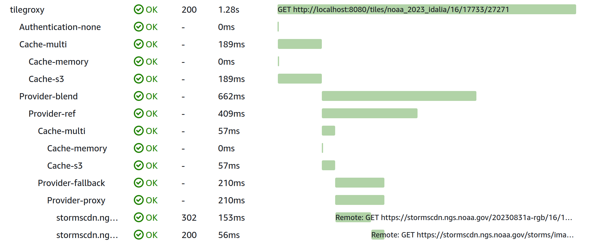

= Telemetry

Tilegroxy supports utilizing https://opentelemetry.io/[OpenTelemetry (OTEL)] to provide portable observability.  This allows you to monitor and "observe" your tilegroxy deployment in tools such as Fluent Bit, CloudWatch, NewRelic, Dynatrace, https://opentelemetry.io/ecosystem/vendors/[etc.]

The supported telemetry data includes metrics, logs, and traces. These are disabled by default and can by turned on by setting `telemetry: enabled: true` in your configuration or `TELEMETRY_ENABLED=true` via environment variable.  Tilegroxy only supports the HTTP exporter, not STDOUT or GRPC.  Once telemetry is enabled you will need to use https://opentelemetry.io/docs/languages/sdk-configuration/otlp-exporter/[standard OTEL environment variables] to point the HTTP exporter to your collector.  For example: `+OTEL_EXPORTER_OTLP_ENDPOINT="http://localhost:4318"+`.

== Logs

The "main" application logs will be shipped to OTEL in addition to the destinations link:./configuration.md#log[specified in the configuration]. Access logs are not shipped to OTEL.

== Metrics

Metrics are available for cache hit/miss and the number of tile requests broken down by status. The full list of metrics:

|===
| Metric | Description

| tilegroxy.tiles.total.request
| The total number of tile requests received by tilegroxy

| tilegroxy.tiles.total.valid
| The number of tile requests received by tilegroxy that pass validation and authentication checks

| tilegroxy.tiles.total.error
| The number of tile requests that result in an error excluding validation and authentication

| tilegroxy.tiles.total.success
| The number of tiles requests that result in a successful response - this includes when a fallback kicks in

| tilegroxy.tiles.layer.\{layerId}.request
| The number of requests processed against the indicated layer

| tilegroxy.tiles.layer.\{layerId}.error
| The number of errors that occur trying to generate a tile for the indicated layer

| tilegroxy.tiles.layer.\{layerId}.success
| The number of tile successfully generated for the indicated layer

| tilegroxy.tiles.layer.\{layerId}.auth
| The number of outgoing authentication checks performed for the indicated layer

| tilegroxy.cache.total.hit
| The number of cache lookups that result in a tile

| tilegroxy.cache.total.miss
| The number of cache lookups that don't result in a tile

| http.server.response.size
| Provided by otelhttp. Reflects the size of responses bodies returned from tilegroxy in bytes

| http.server.request.size
| Provided by otelhttp. Reflects the size of request bodies sent to tilegroxy in bytes

| http.server.duration
| Provided by otelhttp. Reflects the time tilegroxy spends processing a request

| http.client.duration
| Provided by otelhttp. Reflects the time tilegroxy waits on requests to external APIs

| http.client.response.size
| Provided by otelhttp. Reflects the size of responses bodies from external APIs called by tilegroxy in bytes

| http.client.request.size
| Provided by otelhttp. Reflects the size of request bodies sent to external APIs by tilegroxy in bytes
|===

When using patterns with layers, metrics are logged against the ID of the layer not the name passed into the URL.  If using a Ref provider (including indirectly via the  Blend provider), the "child" layer requests are recorded in the layer-specific metrics *but not* the total metrics.

== Traces

Traces are generated for all incoming requests into tilegroxy.  For tile requests we include a parent span named "tilegroxy" that then includes child spans for providers, authentication, and cache.  Additionally child spans are generated for outgoing HTTP requests.  Utilizing these spans allows you to see a breakdown of where time is spent for a given request and where errors occur, this is especially useful for complicated layer setups.

An example trace (display depends on the vendor):

