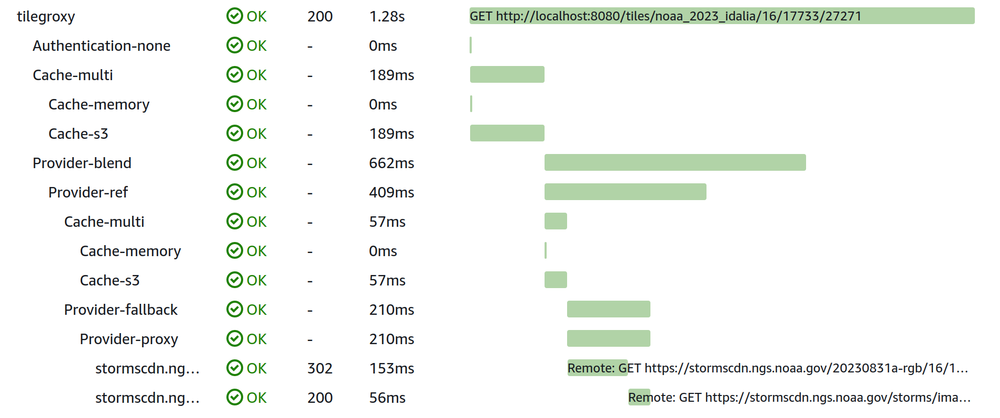

# Telemetry

Tilegroxy supports utilizing [OpenTelemetry (OTEL)](https://opentelemetry.io/) to provide portable observability.  This allows you to monitor and "observe" your tilegroxy deployment in tools such as Fluent Bit, CloudWatch, NewRelic, Dynatrace, [etc.](https://opentelemetry.io/ecosystem/vendors/)

The supported telemetry data includes metrics, logs, and traces. These are disabled by default and can by turned on by setting `telemetry: enabled: true` in your configuration or `TELEMETRY_ENABLED=true` via environment variable.  Tilegroxy only supports the HTTP exporter, not STDOUT or GRPC.  Once telemetry is enabled you will need to use [standard OTEL environment variables](https://opentelemetry.io/docs/languages/sdk-configuration/otlp-exporter/) to point the HTTP exporter to your collector.  For example: `OTEL_EXPORTER_OTLP_ENDPOINT="http://localhost:4318"`.  

## Logs

The "main" application logs will be shipped to OTEL in addition to the destinations [specified in the configuration](./configuration.md#log). Access logs are not shipped to OTEL.

## Metrics

Metrics are available for cache hit/miss and the number of tile requests broken down by status. The full list of metrics:

| Metric | Description |
| ------ | ----------- |
| tilegroxy.tiles.total.request | The total number of tile requests received by tilegroxy |
| tilegroxy.tiles.total.valid | The number of tile requests received by tilegroxy that pass validation and authentication checks |
| tilegroxy.tiles.total.error | The number of tile requests that result in an error excluding validation and authentication |
| tilegroxy.tiles.total.success | The number of tiles requests that result in a successful response - this includes when a fallback kicks in |
| tilegroxy.tiles.layer.{layerId}.request | The number of requests processed against the indicated layer |
| tilegroxy.tiles.layer.{layerId}.error | The number of errors that occur trying to generate a tile for the indicated layer |
| tilegroxy.tiles.layer.{layerId}.success | The number of tile successfully generated for the indicated layer |
| tilegroxy.tiles.layer.{layerId}.auth | The number of outgoing authentication checks performed for the indicated layer |
| tilegroxy.cache.total.hit | The number of cache lookups that result in a tile |
| tilegroxy.cache.total.miss | The number of cache lookups that don't result in a tile |
| http.server.response.size | Provided by otelhttp. Reflects the size of responses bodies returned from tilegroxy in bytes | 
| http.server.request.size | Provided by otelhttp. Reflects the size of request bodies sent to tilegroxy in bytes | 
| http.server.duration | Provided by otelhttp. Reflects the time tilegroxy spends processing a request | 
| http.client.duration | Provided by otelhttp. Reflects the time tilegroxy waits on requests to external APIs | 
| http.client.response.size | Provided by otelhttp. Reflects the size of responses bodies from external APIs called by tilegroxy in bytes | 
| http.client.request.size | Provided by otelhttp. Reflects the size of request bodies sent to external APIs by tilegroxy in bytes | 

When using patterns with layers, metrics are logged against the ID of the layer not the name passed into the URL.  If using a Ref provider (including indirectly via the  Blend provider), the "child" layer requests are recorded in the layer-specific metrics **but not** the total metrics.

## Traces

Traces are generated for all incoming requests into tilegroxy.  For tile requests we include a parent span named "tilegroxy" that then includes child spans for providers, authentication, and cache.  Additionally child spans are generated for outgoing HTTP requests.  Utilizing these spans allows you to see a breakdown of where time is spent for a given request and where errors occur, this is especially useful for complicated layer setups.

An example trace (display depends on the vendor):

